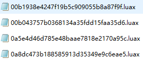
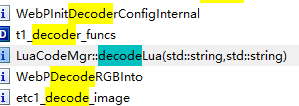
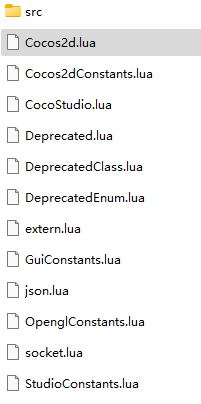
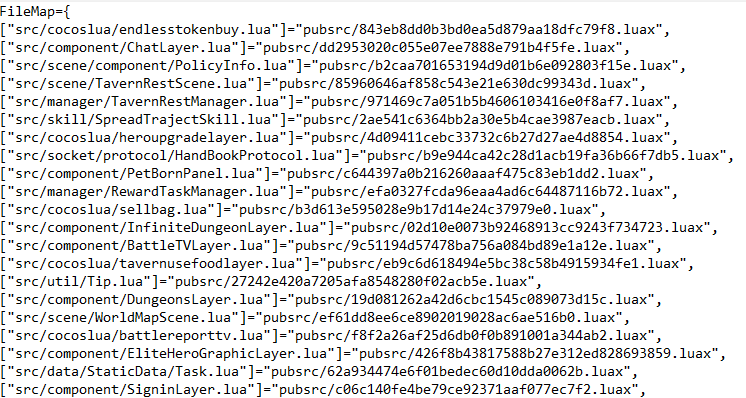
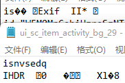

This is notes about my experience on how I dumped decoded lua files and asset files from an android game

Requirements:

1. Rooted android device
2. android debug bridge
3. IDA
4. Frida

#### Step 1 

First lets unzip the apk, in assets/pubsrc we get a bunch of .luax files, opening them with text editor shows encoded strings, these are most likely the encoded lua files we are looking for, but they are not encoded using xxtea method because every files starts with different strings, therefore we can't decode them directly without knowing how they are encoded.

 

#### Step 2

Now that we have the files, we need to know how to decode them, the application must have a decoding method somewhere so it can execute these scripts, lets try to find that.

In lib\arm64-v8a we have the .so file libcocos2dlua.so, open that in IDA64. Searching in Exports tab for 'decode', one of the function is `decodeLua`, this could be what we are looking for, lets look into that.



The pseudo code IDA generates for us is 

```
__int64 __usercall LuaCodeMgr::decodeLua@<X0>(_QWORD *a1@<X1>, __int64 a2@<X2>, __int64 a3@<X8>)
{
  unsigned __int64 v6; // x2
  cocos2d::FileUtils *v7; // x0
  __int64 v8; // x0
  void *v9; // x0
  unsigned int *v11; // x2
  int v12; // w1
  __int64 v13; // [xsp+28h] [xbp-8h] BYREF

  v6 = (sub_7ED428(a1, "/", -1, 1u) + 1);
  if ( v6 > *(*a1 - 24LL) )
    sub_7EBD20("%s: __pos (which is %zu) > this->size() (which is %zu)", "basic_string::substr");
  v7 = sub_7EF744(&v13, a1, v6, 16LL);
  v8 = cocos2d::FileUtils::getInstance(v7);
  cocos2d::FileUtils::DecodeFile(v8, a1, a2);
  v9 = (v13 - 24);
  if ( (v13 - 24) != &qword_BED8A0 )
  {
    v11 = (v13 - 8);
    do
      v12 = __ldaxr(v11);
    while ( __stlxr(v12 - 1, v11) );
    if ( v12 <= 0 )
      operator delete(v9);
  }
  return a3;
}
```

hm, it takes a real professional to understand all this, looks like it calls `DecodeFile` function which is even harder to understand, this method has reached a deadend.

#### Step 3

What about using debugger and pause the application then dumping the files from memory?

Before we start we need to do some preparation work.

1. Get a rooted Android device and install `adb` on your system

2. Push `dbgsrv/android_server` or `dbgsrv/android_server64` (depending on what system your phone uses) to your phone and execute it in `adb shell`.

   it's recommended to rename it to avoid application scanning files for anti debug

   ```
   adb push android_server /data/local/temp/as
   adb shell
   su
   cd /data/local/tmp
   chmod 777 as (only need to run this once)
   ./as
   ```

3. After your android_server is running, open another terminal to port forward, you can also use another port other than default(23946) to avoid port scanning, but I'm not going to show that here.

   ```
   adb forward tcp:23946 tcp:23946
   ```

4. Open the application in debug mode, after this command your phone should say something like xxx is waiting for debugger

   ```
   adb shell am start -D -n (applicationName/activityName)
   ```

5. Now open IDA again, on toolbar select `Debugger -> Attach -> Remote ARM Linux/Android Debugger`, Hostname `127.0.0.1`, Port `23946 (or what you changed it to in 3)`, click ok and select the process the application is running at.

6. At this point debugger is already attached, but the application is still paused, we need to resume it. First we need to know what port it's listening at, open Android Device Manager.

   

   Here my application is listening on port 8663

   ```
   jdb -connect com.sun.jdi.SocketAttach:hostname=127.0.0.1,port=8663
   ```

   Application should now run with debugger, but it closes the moment we resume it, possibly another anti debug method?

#### Step 4

We need to investigate why application closed when debugger is attached, back to IDA and search for anti_debug, we can find the method that's responsible for anti debug, and one segment is

```
result = pthread_equal(a14, 0LL);
if ( !result )
	std::terminate();
```

It looks like it's comparing something to 0, now a basic knowledge is an application's `TracerPid  `is normally 0 but will change when a debugger is attached, this is possibly what it's checking here, so our solution is to somehow make `TracerPid` stay 0 even when it has a debugger.

Solution is to use Frida to hook the application and overwrite its `TrackerPid`.

Create file `overwriteTracerPid.js`

```javascript
var anti_fgets = function () {
  var fgetsPtr = Module.findExportByName("libc.so", "fgets");
  var fgets = new NativeFunction(fgetsPtr, 'pointer', ['pointer', 'int', 'pointer']);
  Interceptor.replace(fgetsPtr, new NativeCallback(function (buffer, size, fp) {
    var retval = fgets(buffer, size, fp);
    var bufstr = Memory.readUtf8String(buffer);
    if (bufstr.indexOf("TracerPid:") > -1) {
      Memory.writeUtf8String(buffer, "TracerPid:\t0");
      // dmLogout("tracerpid replaced: " + Memory.readUtf8String(buffer));
    }
    return retval;
  }, 'pointer', ['pointer', 'int', 'pointer']));
};
```

Now start application with Frida instead of adb

```
frida -U -f (applicationName) -l hook.js --no-pause
```

and attach debugger like before, success!

#### Step 5

Even though a debugger is attached, the program still crashes when it stops at a breakpoint, more anti debug? But this time I couldn't find what is causing this, so debugger method also reached a dead end, all this effort wasted! But it's expected, reverse engineering involves a lot of trial and error, don't give up!

#### Step 6

Direct decoding and debugger both failed, is this task possible? Maybe.

Frida also has a feature to hook Java methods, what if we hook the method that loads the lua files and dump from there?

create file `main.py` as our server, this will spin up a server, open application on our phone, receive message from Frida, then write those methods in a file.

```python
import time
import frida
import sys
import os
import codecs
import binascii
import base64

def savefile(path, data):
    print(path)
    if not os.path.exists(os.path.dirname(path)):
        try:
            os.makedirs(os.path.dirname(path))
        except OSError as exc:  # Guard against race condition
            raise
    with codecs.open(path, 'wb', 'utf-8') as f:
        f.write(data.decode('utf-8'))

def on_message(message, data):
    if 'payload' in message and message['type'] == 'send':
        print(message)
        payload = message['payload']
        origin_path = payload['path']
        if 'dump' in payload:
            dump = payload['dump']
            savefile(origin_path,dump.encode('utf-8'))
            return
        if message['type'] == 'send':
            print(data)
            savefile(origin_path,data)
        else:
            print(message)

device = frida.get_usb_device()
pid = device.spawn(["ApplicationName"])
device.resume(pid)
time.sleep(1)
session = device.attach(pid)
with open("dumpLua.js") as f:
    script = session.create_script(f.read())
script.on("message", on_message)
script.load()
sys.stdin.read()
```

`dumpLua.js`

```
var nptr = Module.findExportByName('libcocos2dlua.so', "luaL_loadbuffer");
function fn() {
  nptr = Module.findExportByName('libcocos2dlua.so', "luaL_loadbuffer");
  if (!nptr) {
    console.log("luaL_loadbuffer cannot be found!");
    setTimeout(foo, 500);
  } else {
    Interceptor.attach(nptr, {
      onEnter: function(args) {
        var len = args[2].toInt32(); // file length
        var code = args[1].readCString(len); // file content
        send({ path: args[3].readCString() /* filename */, dump: code });
      }
    })
  }
}
var timeout = setTimeout(fn, 500);

```

Before we execute everything, we must run `frida-server` on our phone, process is similar to what we did with `android_server` in Step 3.

After `frida-server` is running, we can run `python main.py` to start.

Success! We dumped all lua files from this application.



Lets open one of them.



Fully decoded as we wanted.

#### Step 7

What about assets? let's go back to our unzipped folder and navigate to assets/res/component, there are `.plist`, `.pvr.ccz` files and also files without any extension.

`.plist` and `.pvr.ccz` we can open with `Texture Packer`, what are those files without any extension?

Opening one in text editor



There are two types, one start with `is`, the other starts with `isnvsedq`

Searching for `isnvsedq` in IDA, we get this function

```
bool __fastcall cocos2d::Image::isPng(cocos2d::Image *this, unsigned __int8 *a2, __int64 a3)
{
  _BOOL8 result; // x0

  result = 0LL;
  if ( a3 > 8 )
  {
    if ( !memcmp("isnvsedq", a2, 8u) )
      *a2 = 0xA1A0A0D474E5089LL;
    result = memcmp(&qword_9705E0, a2, 8u) == 0;
  }
  return result;
}
```

`0xA1A0A0D474E5089LL` is starting bytes for .png files, so all it does is replace the starting bytes with .png file's starting bytes.

Similar with `is`, replacing `is` with `-9985` to make it a .jpg file

```
bool __fastcall cocos2d::Image::isJpg(cocos2d::Image *this, unsigned __int8 *a2, __int64 a3)
{
  _BOOL8 result; // x0

  result = 0LL;
  if ( a3 > 4 )
  {
    if ( !memcmp(a2, &unk_9705F0, 2u) )
      *a2 = -9985;
    result = memcmp(a2, &word_970600, 2u) == 0;
  }
  return result;
}
```

Simple enough, we can write a script to decode everything for us.

```python
import sys
import os
import mmap

if __name__ == '__main__':
    if len(sys.argv) != 3:
        print("USAGE: python fixPng.py [directory] [output]")
    else:
        path = sys.argv[1]
        output = sys.argv[2]
        if not os.path.exists(output):
            os.makedirs(output)
        if os.path.isdir(path):
            allFilesArray = current_files = os.listdir(path)
            for file in allFilesArray:
                if not os.path.isdir(file):
                    filename = file
                    print(filename)
                    with open(path + '/' + filename, "r+b") as oriFile:
                        mm = mmap.mmap(oriFile.fileno(), 0)
                        if mm[:8] == b'isnvsedq':
                            with open(output + '/' + filename + '.png', "wb") as newFile:
                             	newFile.write(b'\x89\x50\x4e\x47\x0d\x0a\x1a\x0a')
                                newFile.write(mm[8:])
                        elif mm[:1] == b'\x69':
                            with open(output + '/' + filename + '.jpg', "wb") as newFile:
                                newFile.write(b'\xff\xd8\xff')
                                newFile.write(mm[3:])
```

Just execute this script and it will generate all decoded assets.

#### Advanced

We have all the files we want, but what fun is there to just look at them and not be able to change them ourselves? Could we hook `luaL_loadbuffer` to have the application load lua files we write ourselves?

Yes! Here I overwrote `ChatLayer.lua` with my own lua script, simply start application with this hook and it will run our own lua files.

```javascript
const scriptMap = {
  'src/component/ChatLayer.lua': chat
}

function foo() {
  nptr = Module.findExportByName('libcocos2dlua.so', "luaL_loadbuffer")
  if (!nptr) {
    console.log("luaL_loadbuffer cannot be found!")
    setTimeout(foo, 500)
  } else {
    Interceptor.attach(nptr, {
      onEnter: function(args) {
        let scriptToInject = scriptMap[args[3].readCString()]
        if (scriptToInject) {
          try {
            args[1].writeUtf8String(scriptToInject)
            const size = 2 * scriptToInject.length - args[1].readCString(scriptToInject.length).length
            args[2] = ptr(size + (scriptToInject.length - args[1].readCString(size).length))
          } catch(e) {
            console.log(e)
          }
        }
      }
    })
  }
}
var timeout = setTimeout(foo, 500)
```

Note: if the file you created is significantly larger than original file, it might cause buffer overflow and the application might fail to start, there may be a solution for this case but I haven't found it yet.

#### Follow-up

Although everything is working the way we wanted, is there a way to modify the lua files without connecting phone to pc, running `frida-server`, executing a script and all that stuff? Would it be possible to make this process more simple like inject the modified lua files back to the apk and repack?

#### Update: Atlas and Json files for animation

Atlas and json files are used to create skeleton animation in cocos2d-x, but they are encrypted differently than lua and images.

We can get `atb` and `jn` files which are the encrypted files, but without knowing how to decode them they can't be used. We can also get the decrypted file with similar hook we used to get decrypted lua files, but it can only load files that are loaded, how do we get all the assets?

Back traced some function in IDA and found this function `cocos2d::FileUtils::DecodeFile`

```
cocos2d::Data *__usercall cocos2d::FileUtils::DecodeFile@<X0>(__int64 a1@<X0>, __int64 a2@<X1>, const char *a3@<X2>, cocos2d::Data *a4@<X8>)
{
  const char *v4; // x21
  cocos2d::FileUtils *v8; // x0
  __int64 v9; // x0
  __int64 v10; // x0
  __int64 v11; // x22
  _BYTE *v12; // x25
  _BYTE *v13; // x23
  int v14; // w19
  __int64 v15; // x20
  int v16; // w2
  unsigned __int64 v17; // x0
  unsigned __int64 v18; // x0
  size_t byte_count[2]; // [xsp+58h] [xbp-8h] BYREF

  v4 = a3;
  if ( !a3 )
    v4 = *(a1 + 184);
  *(a1 + 192) = 0;
  v8 = cocos2d::Data::Data(a4);
  *byte_count = 0LL;
  v9 = cocos2d::FileUtils::getInstance(v8);
  v10 = (*(*v9 + 48LL))(v9, a2, "rb", byte_count);
  v11 = *byte_count;
  v12 = v10;
  v13 = malloc(byte_count[0]);
  if ( v11 > 0 )
  {
    v14 = *(a1 + 192);
    v15 = 0LL;
    v16 = v14;
    do
    {
      v13[v15] = v12[v15] - v4[v16];
      ++v15;
      v17 = strlen(v4);
      v18 = (v14 + 1) - (v14 + 1) / v17 * v17;
      *(a1 + 192) = v18;
      v16 = v18;
      v14 = v18;
    }
    while ( v11 != v15 );
    v13 += v11;
  }
  free(v12);
  cocos2d::Data::fastSet(a4, &v13[-v11], *byte_count);
  return a4;
}
```

where `v13` is the returned bytes, v12 is the encrypted bytes, v4 is some string, so a guess is encrypted byte - some byte = decrypted byte, since we already have encrypted and decrypted files, we can test this theory. Note we need to open the files in editor like UltraEdit to see the hex values instead of encoded text.

Take encrypted file `TX_UI_0381.atb`

first few bytes are `81 79 87 6A 3D 3B 9A BB B1 C7 BE C7 88 6D 95 AA`

In the decrypted file `TX_UI_0381.atlas`

first few bytes are `54 58 5F 55 49 5F 30 33 38 31 2E 70 76 72 2E 63`

First impression is all values in encrypted file is larger than decrypted file, so our theory might be correct.

Subtracting both files we get `59 55 4E 4D 49 41 4F 32 30 31 34 52 45 53 59 55 4E 4D...`

Repeating values, which is a good sign, take `59 55 4E 4D 49 41 4F 32 30 31 34 52 45 53` and open it in utf-8 encoding we get the string `YUNMIAO2014RES`

Now we can just create a python script to decrypt all `atb` and `jn` files.

```python
secretKey = b'\x59\x55\x4E\x4D\x49\x41\x4F\x32\x30\x31\x34\x52\x45\x53' # "YUNMIAO2014RES"
with open(path + '/' + filename, "r+b") as oriFile:
    mm = mmap.mmap(oriFile.fileno(), 0)
    ...
    elif filename.endswith('.atb') or filename.endswith('.jn'):
        iterator = 0
    append = '.atlas'
        if filename.endswith('.jn'):
            append = '.json'
        with open(output + '/' + filename.replace(".atb", "").replace(".jn", "") + append, "wb") as newFile:
            for byte in mm:
                 encodedByte = int.from_bytes(byte, "big")
                 keyByte = secretKey[iterator]
                 decodedByte = (encodedByte - keyByte).to_bytes(1, byteorder='big')
                 newFile.write(decodedByte)
                 iterator = iterator + 1
                 if iterator >= len(secretKey):
                      iterator = 0
```

